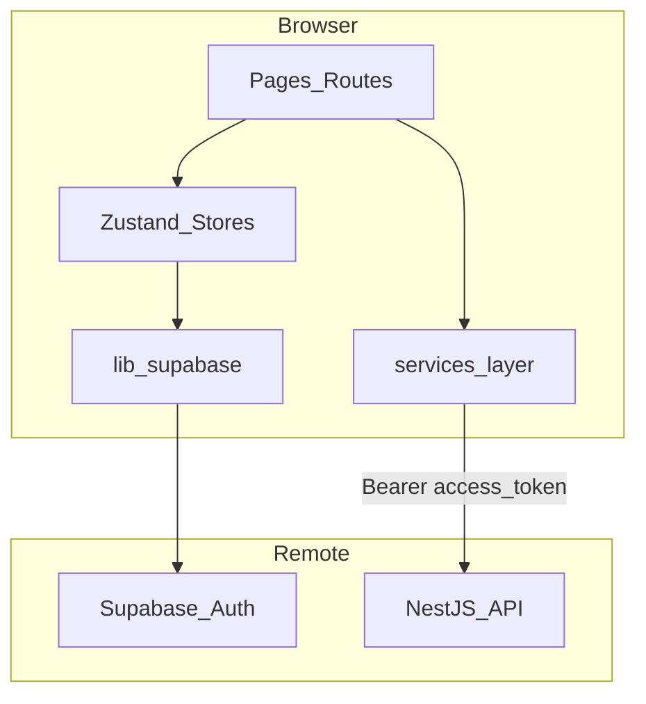

# Frontend architecture

## System context

ExpenseAI frontend is a React SPA (Vite) that:

- authenticates users with Supabase Auth,
- calls backend GraphQL for templates/settings,
- calls backend REST for file upload,
- guides users through onboarding → upload → dashboard workflow.

## Routes and guards

Defined in `src/App.tsx`:

| Path | Condition | Render |
|---|---|---|
| `/` | session exists | `Dashboard` |
| `/` | no session | redirect to `/auth` |
| `/auth` | no session | `Auth` |
| `/auth` | session exists | redirect to `/` |
| `/onboarding` | session exists | `Onboarding` |
| `/onboarding` | no session | redirect to `/auth` |

Onboarding success navigates to `/?setup=upload` to highlight the upload step.

## State management

| Store | File | Responsibility |
|---|---|---|
| `useAuthStore` | `src/store/useAuthStore.ts` | session, user, bootstrapping, sign-out |
| `useOnboardingStore` | `src/store/useOnboardingStore.ts` | questionnaire state + template generation |

Page-level local state is used in `Dashboard` for:

- selected template,
- selected data source (`FILE_UPLOAD` / `NEXTCLOUD`),
- upload form status,
- test-email form status.

## Backend communication pattern

`src/services/onboarding.service.ts` is the API gateway for dashboard/onboarding flows.

### GraphQL operations

- `generateTemplate`
- `myTemplates`
- `myTemplateSettings`
- `createTemplate`
- `updateTemplate`
- `deleteTemplate`
- `setActiveTemplate`
- `updateDataSource`
- `sendTestEmail`

### REST operation

- `POST /api/data-sources/upload` (multipart form-data with file field `file`)
- `GET /api/data-sources/upload/current` (fetch current uploaded file content for preview/edit)
- `PUT /api/data-sources/upload/current` (save edited content over existing uploaded file via multipart `file`)

### URL strategy

- `GRAPHQL_URL = VITE_API_URL || http://localhost:3000/graphql`
- `API_BASE_URL` is derived from `GRAPHQL_URL` by stripping trailing `/graphql`

This lets one env var drive both GraphQL and REST calls.

## Dashboard flow

`Dashboard` combines:

- template gallery (predefined + user templates),
- active template switch,
- source selector:
  - Upload file (`.txt`, `.csv`)
  - Preview/edit current uploaded file content and save overwrite
  - Nextcloud path,
- test-email trigger.

`myTemplateSettings` response is mapped to:

- `dataSourceType`,
- `nextcloudFilePath`,
- `uploadedFilePath`.

## Onboarding flow

1. User fills questionnaire.
2. Frontend calls `generateTemplate`.
3. On success, navigate to `/?setup=upload`.
4. Dashboard prompts user to upload expense file immediately.

## Local template data

Predefined templates are bundled in `src/data/predefinedTemplates.*` and can be converted into persisted user templates when selected.

## UI stack

- Tailwind classes inline
- Lucide icons
- No additional component library

See also [conventions.md](./conventions.md).
