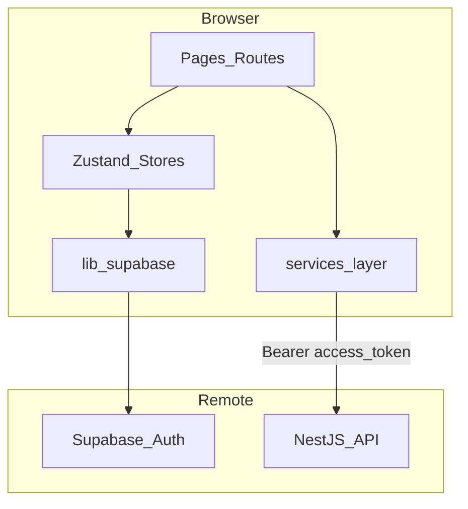

# Frontend architecture

## System context

Spendwell frontend is a React SPA (Vite) that:

- authenticates users with Supabase Auth,
- calls backend GraphQL for templates, settings, file upload, and receipt scanning,
- guides users through onboarding → upload → dashboard workflow,
- provides a receipt scanner page for OCR-based expense entry.

## Routes and guards

Defined in `src/App.tsx`:

| Path            | Condition      | Render              |
| --------------- | -------------- | ------------------- |
| `/`             | session exists | `Dashboard`         |
| `/`             | no session     | redirect to `/auth` |
| `/auth`         | no session     | `Auth`              |
| `/auth`         | session exists | redirect to `/`     |
| `/onboarding`   | session exists | `Onboarding`        |
| `/onboarding`   | no session     | redirect to `/auth` |
| `/receipt-scan` | session exists | `ReceiptScanner`    |
| `/receipt-scan` | no session     | redirect to `/auth` |

Onboarding success navigates to `/?setup=upload` to highlight the upload step. Dashboard links to `/receipt-scan` for receipt-based expense entry.

## State management

| Store                    | File                                  | Responsibility                                       |
| ------------------------ | ------------------------------------- | ---------------------------------------------------- |
| `useAuthStore`           | `src/store/useAuthStore.ts`           | session, user, bootstrapping, sign-out               |
| `useOnboardingStore`     | `src/store/useOnboardingStore.ts`     | questionnaire state + template generation            |
| `useBlockingLoaderStore` | `src/store/useBlockingLoaderStore.ts` | global blocking overlay for user-triggered mutations |

Page-level local state is used in `Dashboard` for:

- selected template,
- selected data source (`FILE_UPLOAD` / `NEXTCLOUD`),
- upload form status,
- test-email form status.

## Backend communication pattern

`src/services/onboarding.service.ts` is the API gateway for dashboard/onboarding flows.

### GraphQL operations

- `generateTemplate`
- `myTemplates`
- `myTemplateSettings`
- `createTemplate`
- `updateTemplate`
- `deleteTemplate`
- `setActiveTemplate`
- `updateDataSource`
- `sendTestEmail`
- `mySummarySchedule`
- `updateSummarySchedule`
- `approveReceiptExpenses`
- `uploadExpenseFile`
- `currentExpenseFile`
- `overwriteCurrentExpenseFile`
- `scanReceipt`

### URL strategy

- `GRAPHQL_URL = VITE_API_URL || http://localhost:3000/graphql`

All backend calls go through this endpoint. File uploads use base64-encoded mutation inputs (`ExpenseFileUploadInput`, `ScanReceiptInput`).

## Dashboard flow

`Dashboard` combines:

- template gallery (predefined + user templates),
- active template switch,
- template preview with web/mobile toggle and touch-like drag-to-scroll (see below),
- source selector:
  - Upload file (`.txt`, `.csv`)
  - Preview/edit current uploaded file content and save overwrite
  - Nextcloud path,
- automatic summary schedule settings (day, hour, timezone, enable/disable),
- test-email trigger,
- link to receipt scanner (`/receipt-scan`).

`myTemplateSettings` response is mapped to:

- `dataSourceType`,
- `nextcloudFilePath`,
- `uploadedFilePath`.

## Receipt scanner flow

`ReceiptScanner` page (`/receipt-scan`):

1. User selects a receipt image (JPEG/PNG/WEBP, max 2MB) and submits for scan.
2. `scanReceipt()` sends the image as a GraphQL mutation with base64 payload.
3. Extracted text is shown in an editable textarea; user can correct OCR/AI output.
4. `approveReceiptExpenses()` sends the edited text via GraphQL mutation.
5. On success, navigates to `/` (expenses appended to the uploaded file on the backend).

## Onboarding flow

1. User fills questionnaire.
2. Frontend calls `generateTemplate`.
3. On success, navigate to `/?setup=upload`.
4. Dashboard prompts user to upload expense file immediately.

## Template preview: web vs mobile

The preview panel in `Dashboard` (`src/pages/Dashboard.tsx`) renders template HTML in an `<iframe srcDoc>` and lets the user switch between two `previewMode` values:

| Mode     | Iframe sizing                              | Purpose                                                                                                                |
| -------- | ------------------------------------------ | ---------------------------------------------------------------------------------------------------------------------- |
| `web`    | Full width of the panel                    | Default desktop-style rendering                                                                                        |
| `mobile` | Fixed `390px`-wide "phone" frame, centered | Forces the template's own `@media (max-width: 620px)` rules to apply, showing exactly how the email renders on a phone |

Mobile mode does **not** alter template markup — it only constrains the iframe's rendered width so the template's own embedded responsive CSS kicks in (see below).

### Touch-like drag-to-scroll in mobile mode

Real touch devices already scroll the iframe natively. To let **mouse** users simulate a finger swipe over the mobile frame, a transparent overlay `
` sits on top of the iframe and uses the Pointer Events API (`onPointerDown`/`onPointerMove`/`onPointerUp`, with `setPointerCapture`) to translate drag distance into scroll offsets.

Because horizontal overflow in these templates lives on a _nested_ element (`.expenses-scroll`, not the top-level document), dragging can't simply call `iframe.contentWindow.scrollTo()`. Instead, `findScrollableAncestor(doc, elementAtPoint, axis)` walks up the DOM from `elementFromPoint()` to find the closest ancestor that is actually scrollable on that axis (checking computed `overflow-x`/`overflow-y` and `scrollWidth`/`scrollHeight`), independently for the horizontal and vertical axes, falling back to the document's root scrolling element. The mouse-wheel handler (attached natively with `{ passive: false }` so `preventDefault()` works) uses the same resolution logic.

## Local template data

Predefined templates are bundled in `src/data/predefinedTemplates.*` and can be converted into persisted user templates when selected.

### Maintaining predefined template HTML

- `src/data/predefinedTemplates.pl.json` is the source of truth; `predefinedTemplates.en.json` is generated from it.
- `scripts/apply-template-responsive.mjs` injects the shared `@media (max-width: 620px)` responsive CSS block and structural classes (`expenses-scroll`, `col-stack`, `kpi-row`, …) into the PL templates. Run it after adding/changing a template's HTML structure.
- `scripts/build-en-templates.mjs` regenerates `predefinedTemplates.en.json` by string-replacing known PL phrases in the (already responsive) PL content — run it after any PL template edit so both locales stay in sync.
- `src/lib/expensesListHtml.ts` builds the `{{ expensesList }}` HTML, including per-category progress bars. The bar's nested tables carry dedicated `progress-track`/`progress-fill` classes so the templates' mobile CSS can explicitly exclude them from rules meant for the outer expense list table (e.g. `min-width`, first-child padding) — without this scoping, descendant selectors like `.expenses-scroll table` would force the percentage-width fill bars to a fixed minimum width, making every bar look the same length regardless of its actual value.

## UI stack

- Tailwind classes inline
- Lucide icons
- No additional component library

See also [conventions.md](./conventions.md).
