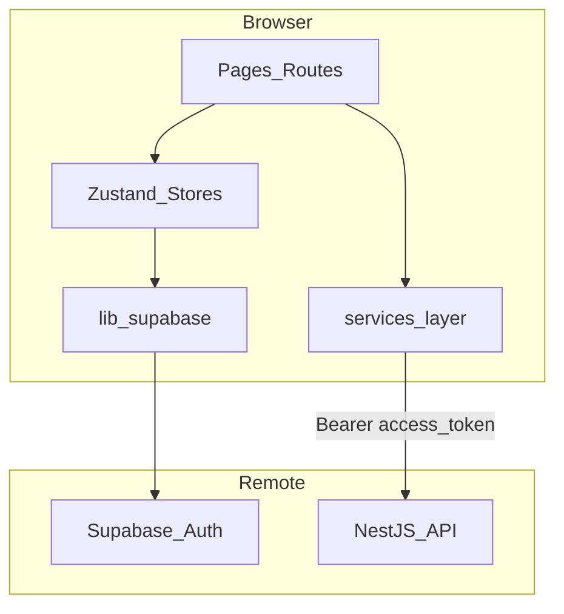
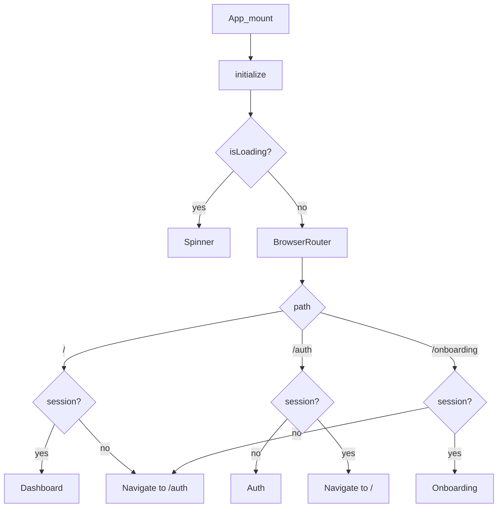
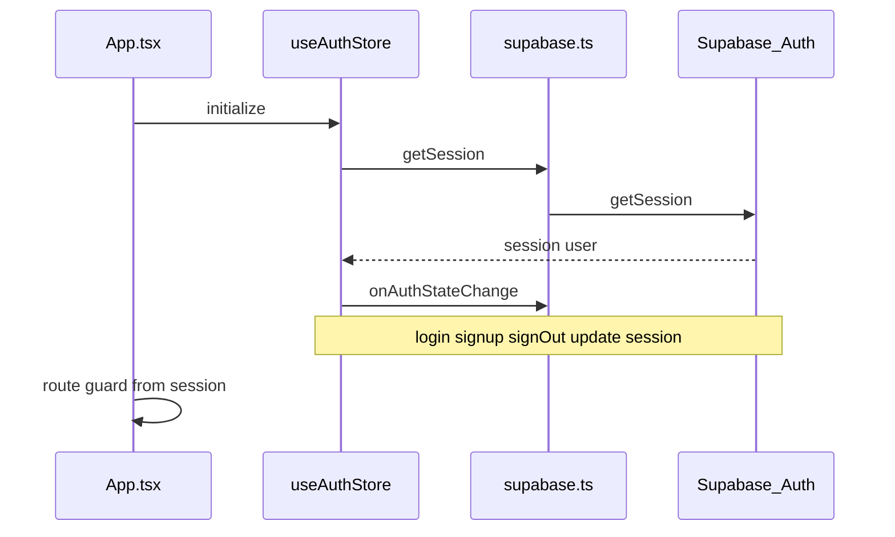
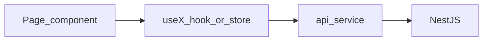
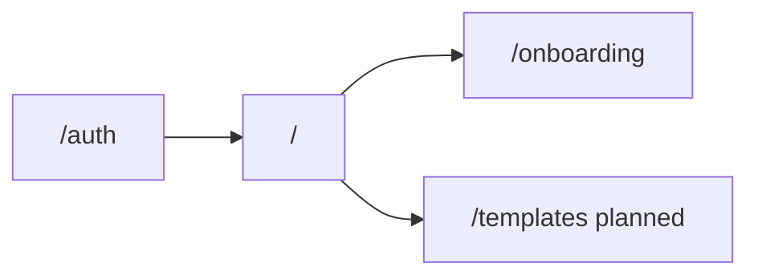

# Frontend architecture

## System context

The SPA handles authentication and will drive onboarding, template CRUD, and settings. Business logic and persistence live in the NestJS backend; Supabase provides Auth and (via the backend) PostgreSQL.

## App shell and routing

Entry: `main.tsx` → `App.tsx`.

`App.tsx` responsibilities:

1. Call `useAuthStore().initialize()` on mount.
2. Show a full-screen spinner while `isLoading` is true.
3. Render `BrowserRouter` with auth-guarded routes.

| Path | Condition | Render |
|------|-----------|--------|
| `/` | `session` present | `Dashboard` component |
| `/` | no session | `<Navigate to="/auth" />` |
| `/auth` | no session | `Auth` component |
| `/auth` | session present | `<Navigate to="/" />` |
| `/onboarding` | session present | `Onboarding` component |
| `/onboarding` | no session | `<Navigate to="/auth" />` |

**Planned routes** (from [PLAN.md](../PLAN.md)):

- `/templates` — CRUD, active template, Nextcloud path
- `/settings` — profile and test email

## State management

| Store | File | Responsibility |
|-------|------|----------------|
| `useAuthStore` | `src/store/useAuthStore.ts` | `user`, `session`, `isLoading`, `initialize`, `signOut` |
| `useOnboardingStore` | `src/store/useOnboardingStore.ts` | Onboarding steps, user preferences, API call for generation |

**Planned stores:** templates list, UI notifications.

Pattern:

- Stores hold client state and async actions that call services.
- Components select minimal state from stores (`useAuthStore(s => s.session)` when optimizing).

## Authentication flow

**Login/signup today:** `Auth.tsx` calls `supabase.auth.signInWithPassword` / `signUp` directly. Session updates propagate via `onAuthStateChange` into the store.

**Target:** move auth mutations into `src/services/auth.service.ts`; components only call store actions.

## Data flow (target)

Example for templates (planned):

1. `TemplatesPage` mounts → `useTemplateStore.fetchAll()`.
2. Store calls `templatesService.list(session.access_token)`.
3. Service `fetch`es NestJS, returns JSON.
4. Store updates; page re-renders.

## Backend communication

- **Auth:** Supabase JS client only (no custom login API).
- **Data:** REST to NestJS (GraphQL mentioned in [PLAN.md](../PLAN.md) — follow backend implementation).
- **Header:** `Authorization: Bearer <access_token>` from `session.access_token`.
- **Base URL:** `import.meta.env.VITE_API_URL` (add to `.env` when backend client is implemented).

Smoke-test endpoint on backend today: `GET /profile`.

## UI stack

- **Tailwind** — layout and components in JSX class names.
- **lucide-react** — icons (`Wallet`, `LogOut`, etc.).
- **No component library** — build primitives in `components/` as needed.

## Planned page map

First-time users: detect missing profile/onboarding server-side or via API, redirect to `/onboarding`.

See [conventions.md](./conventions.md) for file patterns and checklists.
