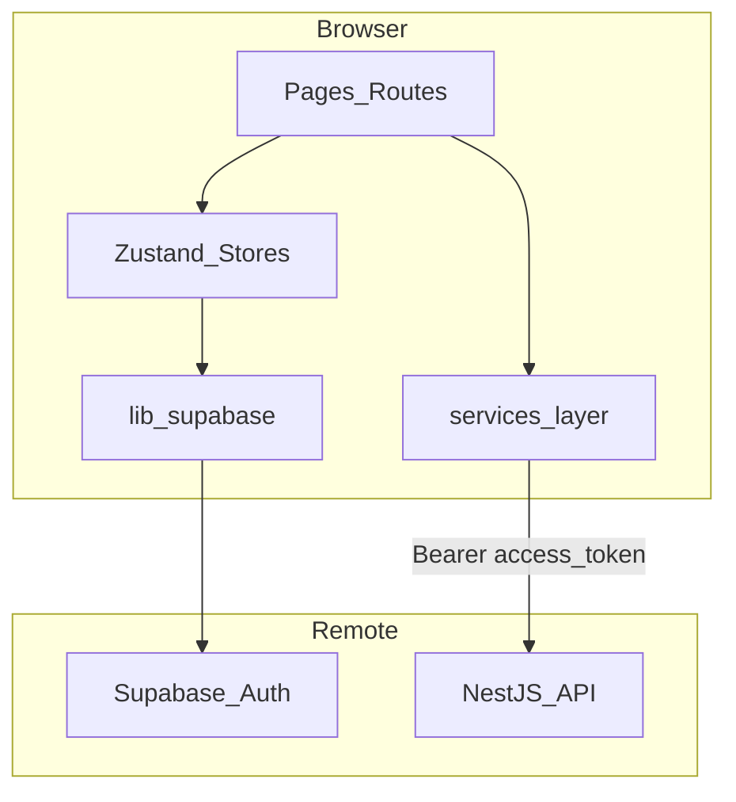

# Frontend architecture

## System context

Spendwell frontend is a React SPA (Vite) that:

- authenticates users with Supabase Auth,
- calls backend GraphQL for templates, settings, AI usage, file upload, receipt scanning, monthly budget, savings goals, analytics summaries, Suggest categories, and month close,
- guides users through onboarding → upload → dashboard workflow,
- provides a receipt scanner page for OCR-based expense entry,
- exposes Analytics (`/analytics`) for ended-month history and live current-month charts,
- exposes a budget planner (`/budget`) for a reusable monthly category plan (optional extra expense),
- exposes long-term expenses (`/savings-goals`) for named savings events,
- runs a **month-close wizard** when leftover cash from the previous month must be allocated before new-month writes,
- exposes Settings (`/settings`) for account, summary schedule, and AI usage.

```mermaid
flowchart TB
  subgraph browser [Browser]
    Pages[Pages_Routes]
    Store[Zustand_Stores]
    Services[services_layer]
    SupaLib[lib_supabase]
  end
  subgraph remote [Remote]
    SupaAuth[Supabase_Auth]
    Backend[NestJS_API]
  end
  Pages --> Store
  Pages --> Services
  Store --> SupaLib
  SupaLib --> SupaAuth
  Services -->|"Bearer access_token"| Backend
```

Page concerns include Dashboard, Analytics, Receipt scanner, Budget, Savings goals, Settings, Onboarding, and the Month-close wizard (surfaced from Dashboard / Analytics / receipt scan when `needsClosure`).

## Routes and guards

Defined in `src/App.tsx`:

| Path             | Condition      | Render              |
| ---------------- | -------------- | ------------------- |
| `/`              | session exists | `Dashboard`         |
| `/`              | no session     | redirect to `/auth` |
| `/auth`          | no session     | `Auth`              |
| `/auth`          | session exists | redirect to `/`     |
| `/onboarding`    | session exists | `Onboarding`        |
| `/onboarding`    | no session     | redirect to `/auth` |
| `/receipt-scan`  | session exists | `ReceiptScanner`    |
| `/receipt-scan`  | no session     | redirect to `/auth` |
| `/analytics`     | session exists | `Analytics`         |
| `/analytics`     | no session     | redirect to `/auth` |
| `/budget`        | session exists | `BudgetPlanner`     |
| `/budget`        | no session     | redirect to `/auth` |
| `/savings-goals` | session exists | `LongTermSavings`   |
| `/savings-goals` | no session     | redirect to `/auth` |
| `/settings`      | session exists | `Settings`          |
| `/settings`      | no session     | redirect to `/auth` |

Onboarding success navigates to `/?setup=upload` to highlight the upload step. Dashboard links to `/receipt-scan` for receipt-based expense entry.

## State management

| Store                    | File                                  | Responsibility                                       |
| ------------------------ | ------------------------------------- | ---------------------------------------------------- |
| `useAuthStore`           | `src/store/useAuthStore.ts`           | session, user, bootstrapping, sign-out               |
| `useOnboardingStore`     | `src/store/useOnboardingStore.ts`     | questionnaire state + template generation            |
| `useBlockingLoaderStore` | `src/store/useBlockingLoaderStore.ts` | global blocking overlay for user-triggered mutations |
| `useUnsavedChangesStore` | `src/store/useUnsavedChangesStore.ts` | dirty-form / navigation guard for in-progress edits  |

Page-level local state is used in `Dashboard` for:

- selected template,
- selected data source (`FILE_UPLOAD` / `NEXTCLOUD`),
- upload form status,
- test-email form status.

## Backend communication pattern

API gateway services under `src/services/`:

| Service                | File                      | Covers                                                                                                                     |
| ---------------------- | ------------------------- | -------------------------------------------------------------------------------------------------------------------------- |
| Onboarding / dashboard | `onboarding.service.ts`   | templates, data source, upload, current-month expenses, Suggest, schedule, test email, salary, send-now, AI usage, account |
| Analytics              | `analytics.service.ts`    | `mySummaries`, `mySummary`, `createManualSummary`, `updateManualSummary`, `summaryCategoryKeys`                            |
| Budget                 | `budget.service.ts`       | `myMonthlyBudget` / `saveMonthlyBudget` (incl. optional extra expense)                                                     |
| Savings goals          | `savingsGoals.service.ts` | `mySavingsGoals` and event / item / contribution mutations                                                                 |
| Month close            | `monthClose.service.ts`   | `monthClosureStatus` / `closeMonth`; Vite dev `?testNow=ISO` → `X-Test-Now`                                                |

### GraphQL operations

- `generateTemplate`
- `myTemplates`
- `myTemplateSettings`
- `createTemplate`
- `updateTemplate`
- `deleteTemplate`
- `setActiveTemplate`
- `updateDataSource`
- `sendTestEmail`
- `mySummarySchedule`
- `updateSummarySchedule`
- `updateSalary`
- `approveReceiptExpenses`
- `uploadExpenseFile`
- `currentMonthExpenses` / `saveCurrentMonthExpenses` / `suggestExpenseCategories`
- `overwriteCurrentExpenseFile`
- `currentExpenseFile`
- `scanReceipt`
- `sendSummaryNow`
- `mySummaries` / `mySummary` / `summaryCategoryKeys`
- `createManualSummary` / `updateManualSummary`
- `myAiUsageSummary`
- `myAiUsageLog`
- `myMonthlyBudget` / `saveMonthlyBudget`
- `mySavingsGoals` / `createSavingsGoalEvent` / `updateSavingsGoalEvent` / `deleteSavingsGoalEvent`
- `createSavingsGoalItem` / `updateSavingsGoalItem` / `deleteSavingsGoalItem`
- `addSavingsGoalContribution` / `deleteSavingsGoalContribution`
- `monthClosureStatus` / `closeMonth`
- `deleteMyAccount`

### URL strategy

- `GRAPHQL_URL = VITE_API_URL || http://localhost:3000/graphql`

All backend calls go through this endpoint. File uploads use base64-encoded mutation inputs (`ExpenseFileUploadInput`, `ScanReceiptInput`).

## Dashboard flow

`Dashboard` combines:

- template gallery (predefined + user templates),
- active template switch,
- template preview with web/mobile toggle and touch-like drag-to-scroll (see below),
- expense source panel:
  - Upload file (`.txt`, `.csv`) — plain lines land in **Unassigned**
  - Category-based current-month editor (`CategoryExpenseForm`) with optional AI **Suggest categories**
  - Save via `saveCurrentMonthExpenses` (writes optional `CategoryKey | name amount` lines)
  - Nextcloud path,
- automatic summary schedule settings (day, hour, timezone, enable/disable),
- test-email trigger,
- link to receipt scanner (`/receipt-scan`),
- month-close banner / wizard entry when `needsClosure` (see below).

`myTemplateSettings` response is mapped to:

- `dataSourceType`,
- `nextcloudFilePath`,
- `uploadedFilePath`.

## Analytics flow

`/analytics` shows ended-month summaries plus an **in-progress current month**:

- Ended months: view / create / edit `SummaryAnalytics` via manual summary form (`analytics.service`).
- Current month: loads `currentMonthExpenses`, editable category form (same as Dashboard), live charts from an in-memory snapshot (no DB row until the month ends, except month close may insert a `MANUAL` snapshot for the **previous** period).

### Investments / three-bucket charts

Product: [monthly-summaries.md](../../expenses-tracking-docs/features/monthly-summaries.md), [ADR 0002](../../expenses-tracking-docs/decisions/0002-investments-as-savings-bucket.md).

Charts treat the canonical `Investments` category as investing/saving, not consumption:

- **Spending vs investing vs free savings** donut — `consumptionSpentCents` / `investedCents` / `savingsCents` (YTD through chart through-period; live current month included from expense-file preview).
- **Monthly savings** column chart — free savings stacked with invested per month.
- **Month-over-month** — income vs consumption spending stacked with invested.

`totalExpensesCents` remains total outflow; invested is derived from categories.

## Month-close UX flow

Product: [month-close.md](../../expenses-tracking-docs/features/month-close.md).

When `monthClosureStatus.needsClosure` is true (previous period leftover **> 0** and not yet closed):

1. Dashboard, Analytics (current-month editor), and receipt approval show a **close banner** instead of (or blocking) new-month expense writes.
2. User opens `CloseMonthWizard`: pick event → sub-goal → amounts until **left to allocate** reaches zero (100% of leftover).
3. Confirm calls `closeMonth`. Contributions appear on `/savings-goals`, the expense file is cleared, and new-month editing unlocks.

In Vite dev, `?testNow=ISO` is forwarded as `X-Test-Now` so the backend can simulate the 1st of the next month.

## Receipt scanner flow

`ReceiptScanner` page (`/receipt-scan`):

1. User selects a receipt image (JPEG/PNG/WEBP, max 5MB) and submits for scan.
2. `scanReceipt()` sends the image as a GraphQL mutation with base64 payload.
3. Extracted text is shown in an editable textarea; user can correct OCR/AI output.
4. `approveReceiptExpenses()` sends the edited text via GraphQL mutation.
5. On success, navigates to `/` (expenses appended to the uploaded file on the backend).

When month close is required, approval is blocked until the previous month is closed.

## Budget planner flow

`/budget` (`BudgetPlanner`) edits the reusable monthly category plan via `budget.service` (`myMonthlyBudget` / `saveMonthlyBudget`).

Optionally the user defines **one extra expense** (named one-off) funded by cut percentages on categories with planned amounts. Planned-allocation and budget-vs-actual charts use **post-cut** amounts and include an extra-expense slice when active. Saving with no extra expense clears any stored one. Product: [budget-planning.md](../../expenses-tracking-docs/features/budget-planning.md).

## Settings flow

`Settings` page (`/settings`) has three tabs:

| Tab      | Content                                                                                |
| -------- | -------------------------------------------------------------------------------------- |
| Account  | Password change (email users) + account deletion                                       |
| Summary  | Automatic summary schedule + **Send summary now**                                      |
| AI usage | Monthly credit remaining (`myAiUsageSummary`) + paginated spend audit (`myAiUsageLog`) |

AI usage table columns: date, action, trigger, tokens, credits, status. Labels are i18n keys under `aiUsage.*` (`en` / `pl`).

## Onboarding flow

1. User fills questionnaire.
2. Frontend calls `generateTemplate`.
3. On success, navigate to `/?setup=upload`.
4. Dashboard prompts user to upload expense file immediately.

## Template preview: web vs mobile

The preview panel in `Dashboard` (`src/pages/Dashboard.tsx`) renders template HTML in an `<iframe srcDoc>` and lets the user switch between two `previewMode` values:

| Mode     | Iframe sizing                              | Purpose                                                                                                                |
| -------- | ------------------------------------------ | ---------------------------------------------------------------------------------------------------------------------- |
| `web`    | Full width of the panel                    | Default desktop-style rendering                                                                                        |
| `mobile` | Fixed `390px`-wide "phone" frame, centered | Forces the template's own `@media (max-width: 620px)` rules to apply, showing exactly how the email renders on a phone |

Mobile mode does **not** alter template markup — it only constrains the iframe's rendered width so the template's own embedded responsive CSS kicks in (see below).

### Touch-like drag-to-scroll in mobile mode

Real touch devices already scroll the iframe natively. To let **mouse** users simulate a finger swipe over the mobile frame, a transparent overlay `
` sits on top of the iframe and uses the Pointer Events API (`onPointerDown`/`onPointerMove`/`onPointerUp`, with `setPointerCapture`) to translate drag distance into scroll offsets.

Because horizontal overflow in these templates lives on a _nested_ element (`.expenses-scroll`, not the top-level document), dragging can't simply call `iframe.contentWindow.scrollTo()`. Instead, `findScrollableAncestor(doc, elementAtPoint, axis)` walks up the DOM from `elementFromPoint()` to find the closest ancestor that is actually scrollable on that axis (checking computed `overflow-x`/`overflow-y` and `scrollWidth`/`scrollHeight`), independently for the horizontal and vertical axes, falling back to the document's root scrolling element. The mouse-wheel handler (attached natively with `{ passive: false }` so `preventDefault()` works) uses the same resolution logic.

## Local template data

Predefined templates are bundled in `src/data/predefinedTemplates.*` and can be converted into persisted user templates when selected.

### Maintaining predefined template HTML

- `src/data/predefinedTemplates.pl.json` is the source of truth; `predefinedTemplates.en.json` is generated from it.
- `scripts/apply-template-responsive.mjs` injects the shared `@media (max-width: 620px)` responsive CSS block and structural classes (`expenses-scroll`, `col-stack`, `kpi-row`, …) into the PL templates. Run it after adding/changing a template's HTML structure.
- `scripts/build-en-templates.mjs` regenerates `predefinedTemplates.en.json` by string-replacing known PL phrases in the (already responsive) PL content — run it after any PL template edit so both locales stay in sync.
- `src/lib/expensesListHtml.ts` builds the `{{ expensesList }}` HTML, including per-category progress bars. The bar's nested tables carry dedicated `progress-track`/`progress-fill` classes so the templates' mobile CSS can explicitly exclude them from rules meant for the outer expense list table (e.g. `min-width`, first-child padding) — without this scoping, descendant selectors like `.expenses-scroll table` would force the percentage-width fill bars to a fixed minimum width, making every bar look the same length regardless of its actual value.

## UI stack

- Tailwind classes inline
- Lucide icons
- No additional component library

See also [conventions.md](./conventions.md).
